# DSP Course Design One

## Program Description

This project implements and compares two methods for computing the Discrete Fourier Transform (DFT):

1. `dft.cpp`  
- Purpose: Direct implementation of the mathematical DFT definition.
- Complexity: $O(N^2)$
- Core formula:
  
  $$X[k] = \sum_{n=0}^{N-1} x[n]\cdot W_N^{kn}, W_N^{kn} = e^{-j 2π k n / N}$$

- Reference implementation:
    ```cpp
    // dft.cpp
    for (int k = 0; k < N; ++k)
    {
        X[k] = Complex(0.0, 0.0);
        for (int n = 0; n < N; ++n)
        {
            double angle = -2.0 * PI * k * n / N;
            Complex W = std::polar(1.0, angle);
            X[k] += x[n] * W;
        }
    }
    ```

2. `fft.cpp`
- Purpose: Efficient in-place FFT using an iterative Radix-2 `DIT`(Decimation-In-Time) algorithm.
- Requirements: N must be a power of two. Use in-place computation. 
- Space complexity $O(1)$
- Time complexity: $O(N \log(N))$
- Key steps:
  
  - Bit-reversal permutation: reorder input indices by bit-reversed positions before the main loop.
  
    ```cpp
    // fft.cpp
    int bits = 0;
    while ((1 << bits) < N) { bits++; }
    ...
    for (int i = 0; i < N; ++i)
    {
        int j = 0; // bit-reversed index of i
        for (int k = 0; k < bits; ++k)
        {
            if ((i >> k) & 1)
            {
                j |= (1 << (bits - 1 - k));
            }
        }
        if (i < j)
        {
            std::swap(a[i], a[j]);
        }
    }
    ```

  - Butterfly computations: combine smaller DFTs into larger ones over $\log_2 N$ stages. 

    ```cpp
    // fft.cpp
    for (int len = 2; len <= N; len <<= 1)
    {
        int halfLen = len / 2;
        Complex W_len_base = std::polar(1.0, -2.0 * PI / len);
        for (int i = 0; i < N; i += len)
        {
            Complex W(1.0, 0.0);
            for (int j = 0; j < halfLen; ++j)
            {
                Complex top = a[i + j];
                Complex bottom = W * a[i + j + halfLen];
                a[i + j] = top + bottom;
                a[i + j + halfLen] = top - bottom;
                W *= W_len_base;
            }
        }
    }
    ```

3. `main.cpp`
- Purpose: generate a test signal (sine wave), run both DFT and FFT, measure execution time using `std::chrono`, compare outputs within an `epsilon tolerance` to verify correctness, and print timings and speed-up.

The rest of the README contains benchmark plots and a comparison table showing execution times and speed-up for various N.

## DFT & FFT Comparison

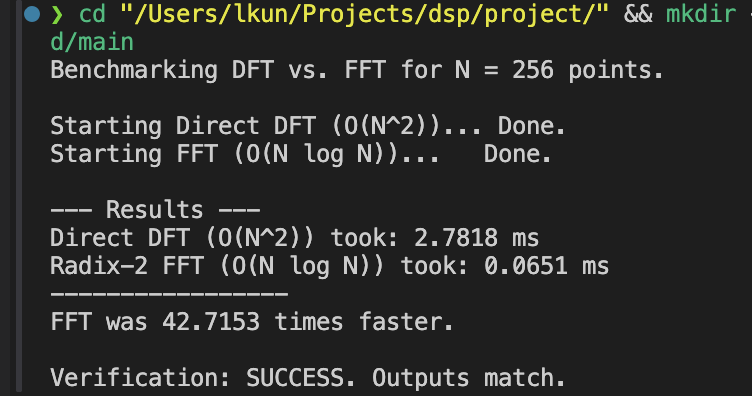

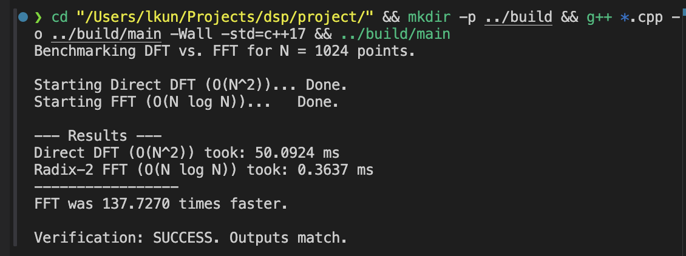

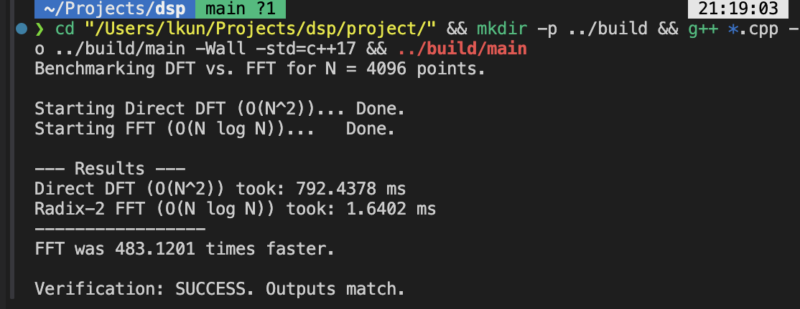

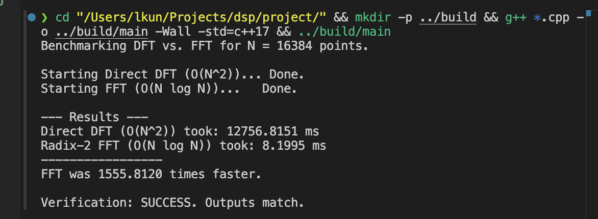

| N             | DFT(ms)    | FFT(ms) | times |
| ------------- | ---------- | ------- | ----- |
| 256 (1<<8)    | 2.7818     | 0.0651  | 43    |
| 1024 (1<<10)  | 50.094     | 0.3637  | 138   |
| 4096 (1<<12)  | 792.4378   | 1.6402  | 483   |
| 16384 (1<<14) | 12756.8151 | 8.1995  | 1556  |

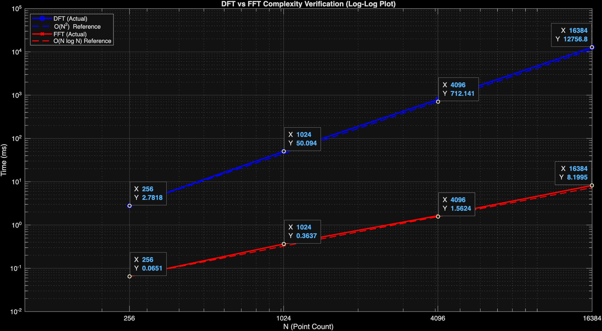

## Spectrum Analysis

### Problem and goals
Given the continuous signal

$s(t) = 0.8·sin(2π\times103t) + 1.0·sin(2π\times107t) + 0.1·sin(2π\times115t)$

Goals:
- Resolve two main peaks separated by 4 Hz (103 Hz and 107 Hz).
- Detect the weak component at 115 Hz (amplitude 0.1) without it being masked by sidelobes.

### Sampling parameter selection
- Highest signal frequency: 115 Hz → Nyquist requires Fs > 230 Hz.
- Chosen sampling rate: Fs = 500 Hz.
- Frequency resolution target $\approx 0.1$ Hz $\rightarrow$ theoretical $N\approx5000$. For FFT efficiency choose N = 4096.
- With N = 4096:
  - $\Delta f = Fs / N \approx 500 / 4096 \approx 0.122$ Hz, sufficient to resolve 4 Hz separation
  - Total acquisition time T = N / Fs = 4096 / 500 = 8.192 s

### Window selection and spectral leakage
- Signal frequencies are not generally integer DFT bins $\rightarrow$ spectral leakage occurs.
- Use window: Hann (Hanning)
  - Formula: $w[n] = 0.5\times(1 − cos(2π n / (N − 1))), n = 0, ..., N−1$
  - Rationale: good sidelobe suppression (reduces leakage that could mask weak tones); main lobe is slightly wider than rectangular but acceptable for this use case.

### Amplitude calibration
- For real-valued tones, unwindowed amplitude approx: $A \approx 2|X[k]|/N, k>0$.
- Hann window has coherent gain $\approx0.5$, so compensate:
  - For k > 0: $A \approx 4|X[k]|/N$
  - Handle DC (k = 0) and Nyquist separately (different factors).

### Final design
- Sampling rate: Fs = 500 Hz  
- FFT length: N = 4096 
- Frequency resolution: $\Delta f \approx 0.122$ Hz  
- Acquisition time: T = 8.192 s  
- Window: Hanning

### Result Comparison

#### CPP Implementation

 -  $N=2^{10}$
    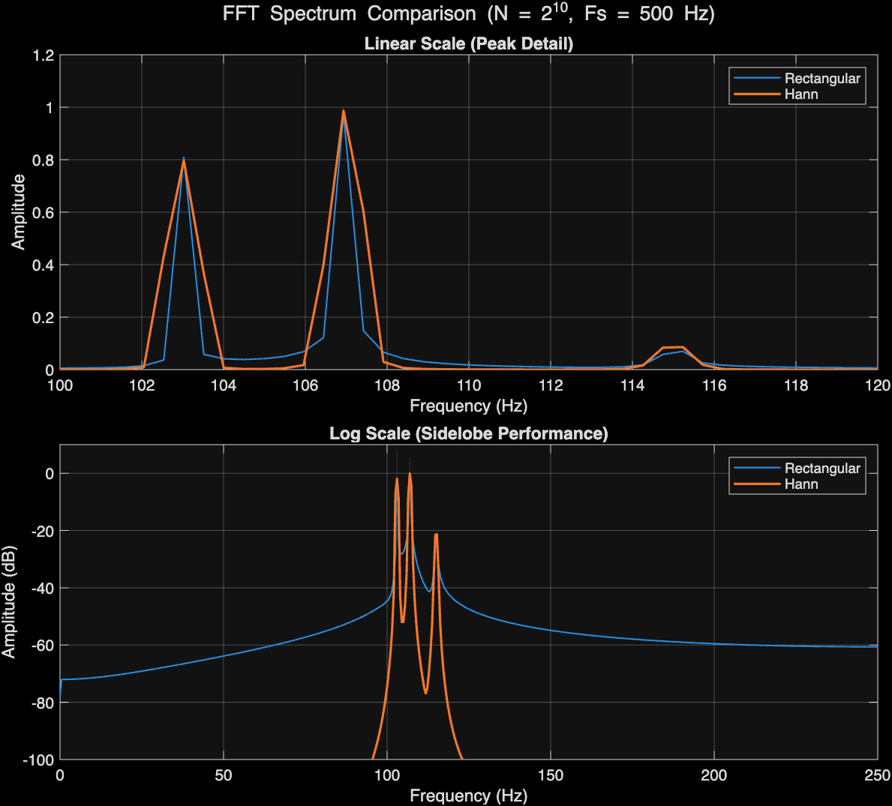

 -  $N=2^{12}$
    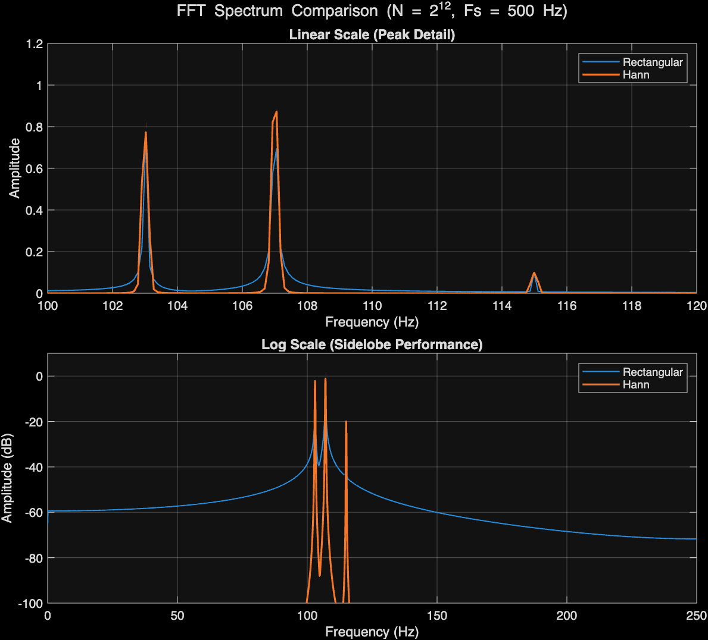  

 -  $N=2^{14}$
    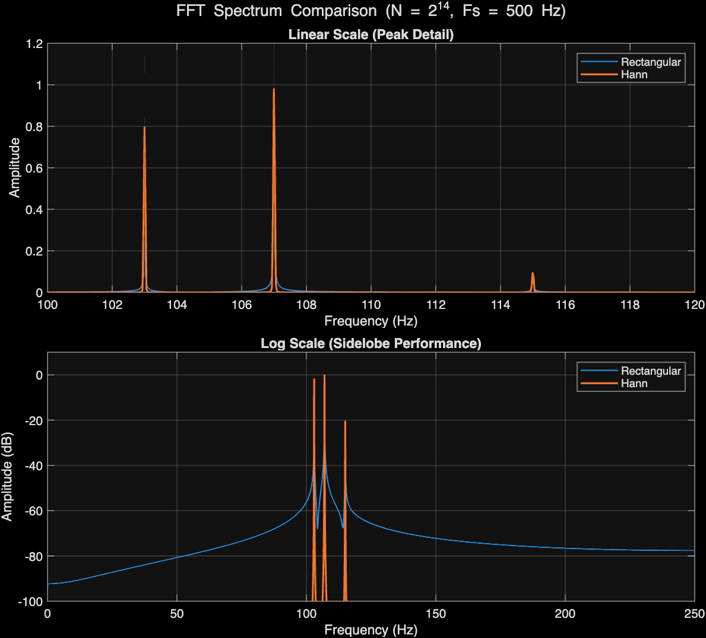

 -  $N=2^{16}$
    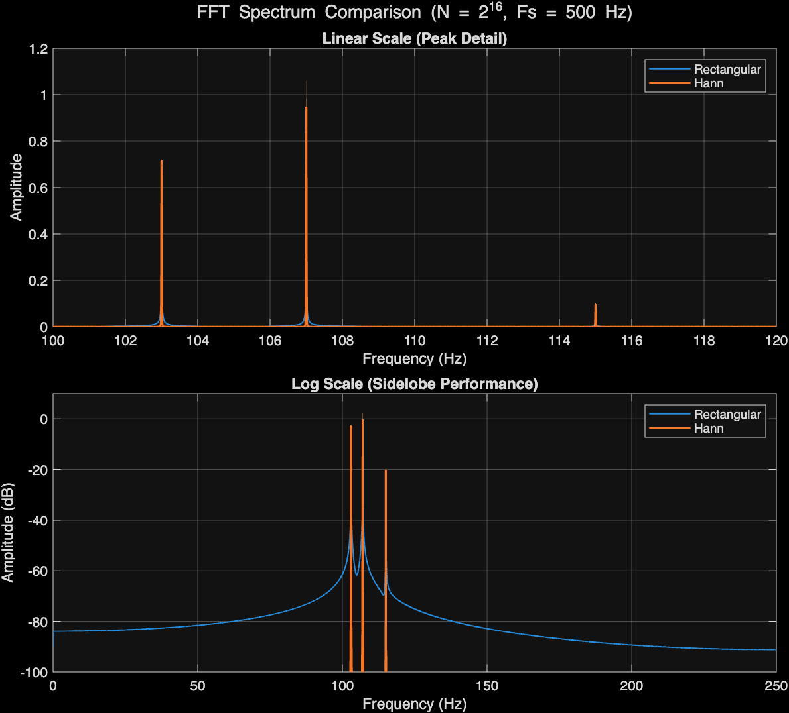

#### MATLAB Analysis

  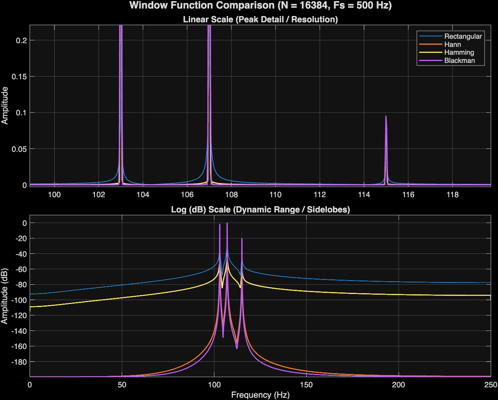
  *Use Different Windows*

  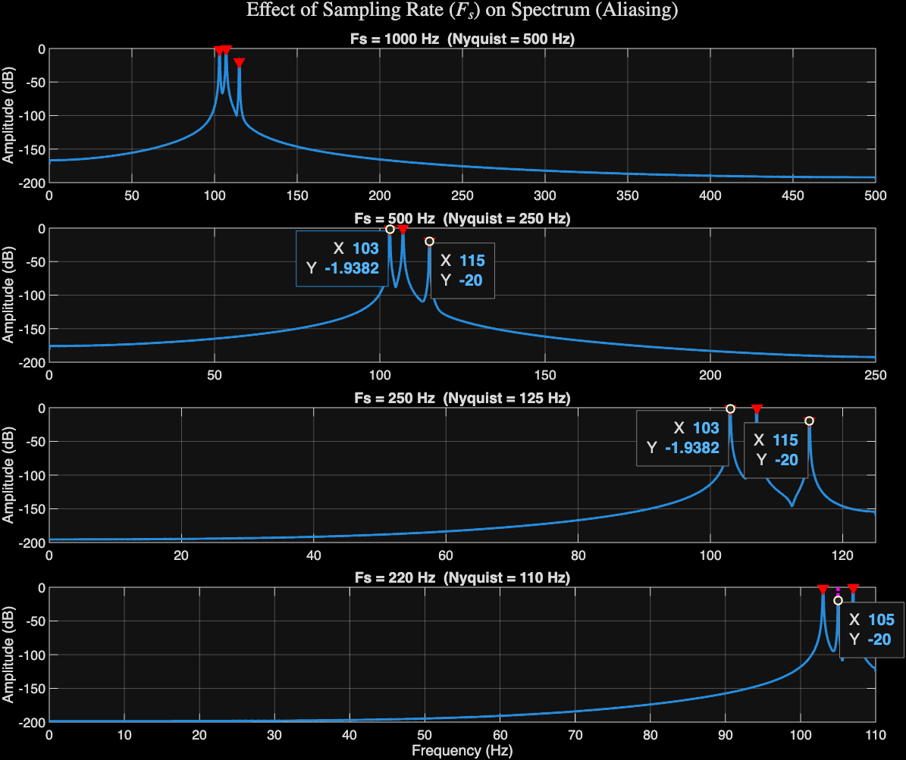
  *Use Different Fs(See Aliasing)*

### Result Analysis

- Analysis 1: All tested $N$ values are sufficient to resolve the 103 Hz, 107 Hz and 115Hz peaks. Increasing $N$ simply improves the precision of the frequency measurement while need more measure time.
- Analysis 2: Hann window will successfully suppress the sidelobes. The spectrum floor will be low, and all three peaks (103, 107, and the weak 115 Hz) will be clearly visible and measurable.